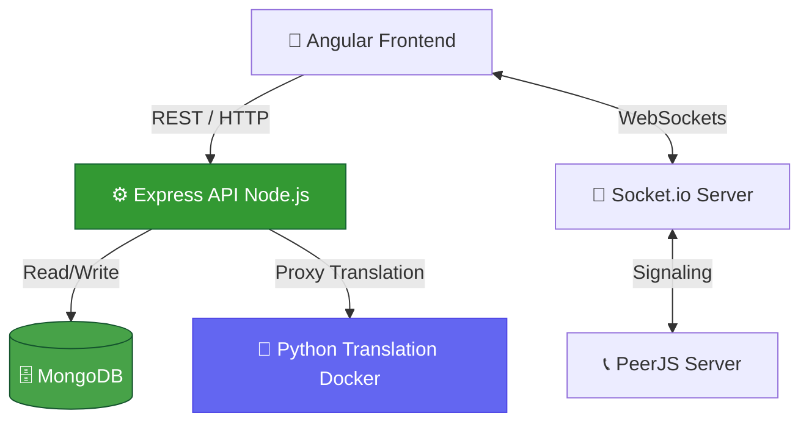

<div align="center">

# 🚀 ORBIT Backend API

<p>
  
  
  
  
  
</p>

<p>
  <strong>The core engine powering the ORBIT Student Dashboard and Video Classes</strong>
  <br />
  <em>Handles auth, courses, assignments, live video signaling, and voice translation proxying</em>
</p>

</div>

---

## ✨ Core Modules

| Module | Description |
|--------|-------------|
| 🔐 **Authentication** | JWT-based login/signup for Students, Faculty, and Admins |
| 📚 **Course Management** | APIs for courses, content, quizzes, and progression |
| 📹 **Video Conferencing** | Socket.io signaling & PeerJS integration for live classes |
| 📼 **Class Recordings** | Metadata tracking and static serving of recorded `.webm` files |
| 🌍 **Voice Translation** | Proxies video translation requests to the Dockerized Python service |

---

## 🏗️ System Architecture



---

## 🚀 Quick Start

### Prerequisites

- **Node.js** (v18+)
- **MongoDB** running locally or via Atlas cluster URI
- **Python Voice Translation Docker** (Optional, for translation features)

### 1️⃣ Installation

```bash
# Navigate to backend directory
cd backend

# Install dependencies
npm install
```

### 2️⃣ Environment Variables

Create a `.env` file in the root of the `backend` directory:

```env
PORT=5000
MONGODB_URI=mongodb://127.0.0.1:27017/orbit
JWT_SECRET=your_super_secret_key_here
```

### 3️⃣ Run the Server

```bash
# Start the server (Port 5000 locally)
node server.js

# Or start with nodemon for development
npm run dev
```

> **Production Deployed URL:** `https://orbitbackend-0i66.onrender.com`

---

## 📡 Key API Routes

### Authentication (`/api/auth`)
- `POST /register` - Register a new user
- `POST /login` - Login and receive JWT

### Courses (`/api/courses`)
- `GET /` - List all courses
- `GET /:id` - Get course details

### Recordings & Translation (`/api/recordings`)
- `GET /` - List all recordings
- `POST /translate-audio` - Proxies to `http://localhost:8001` (Docker)

### Video Call Signaling (`Socket.io`)
- `join-room` - Connect to a live class
- `user-connected` - Broadcast new peer
- `disconnect` - Handle peer drop

---

## 📂 Project Structure

```
backend/
├── 📄 server.js             # Main Express & Socket.io entry point
├── 📁 routes/               # API endpoint definitions
├── 📁 models/               # Mongoose schemas (User, Course, etc.)
├── 📁 controllers/          # Business logic for routes
├── 📁 middleware/           # JWT auth and file upload interceptors
├── 📁 video-call/           # Static HTML/JS for recording player
└── 📄 package.json          # Node dependencies
```

---

<div align="center">

### Built with ❤️ for ORBIT

<p>
  
  
  
</p>

</div>
